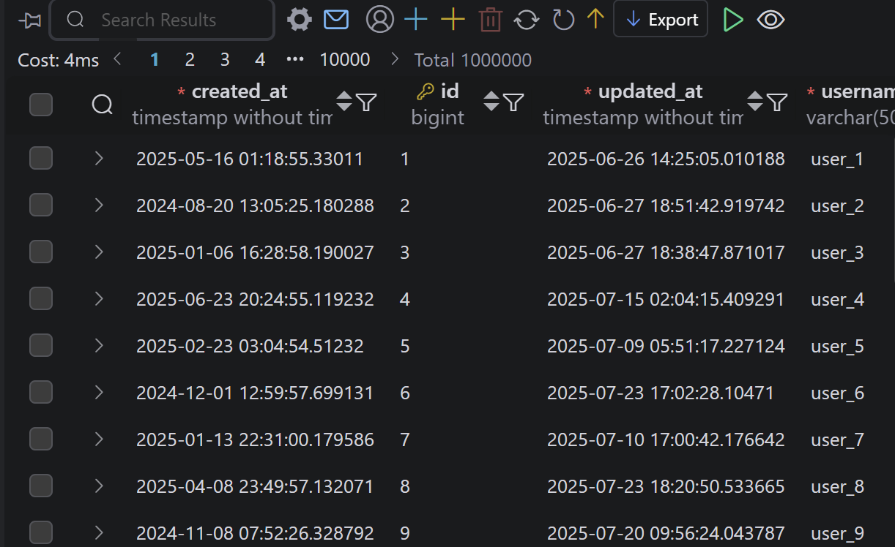
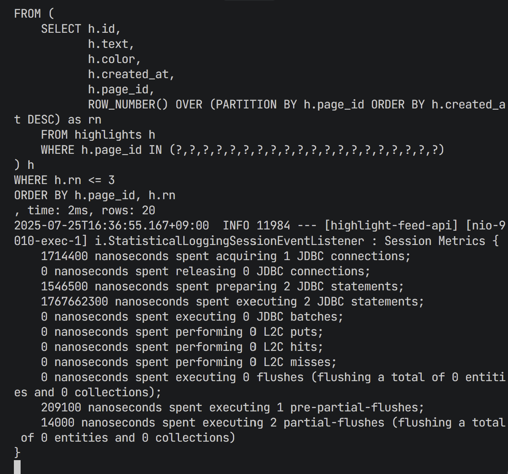
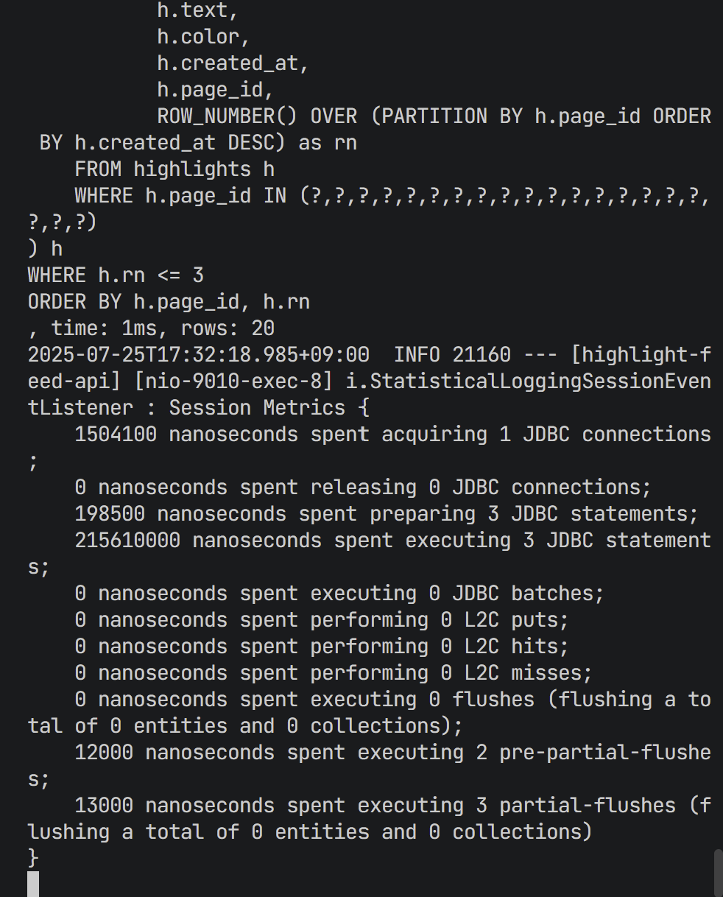
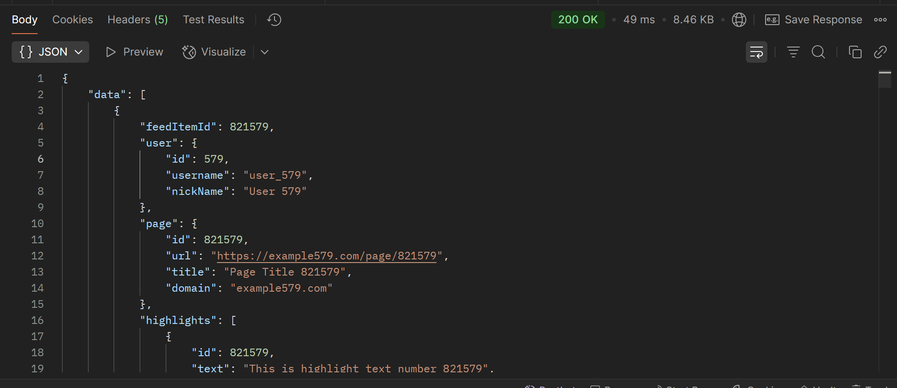
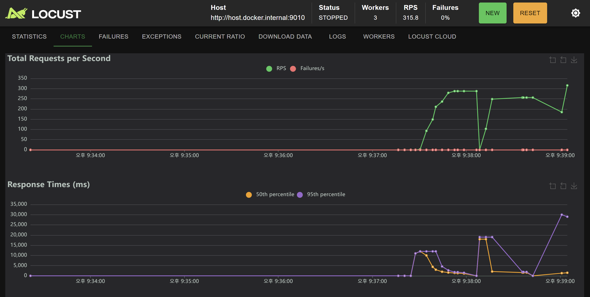
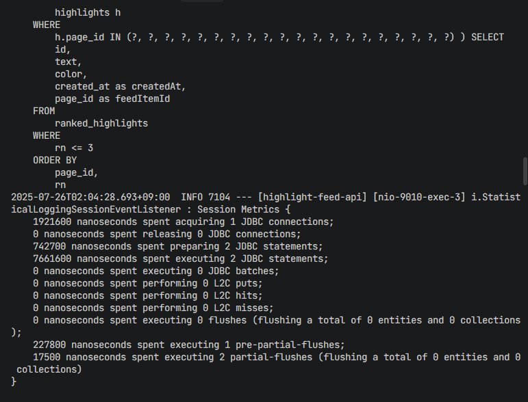
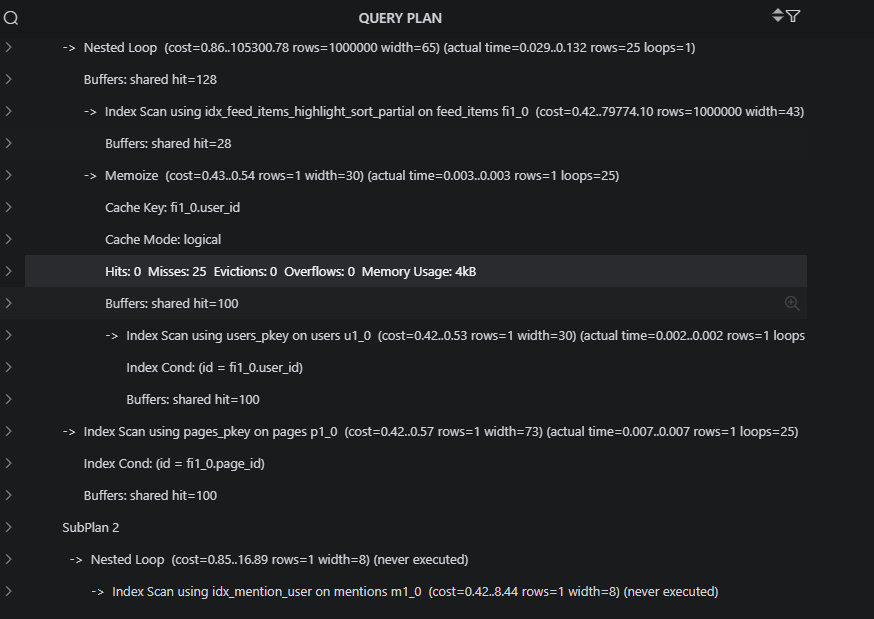
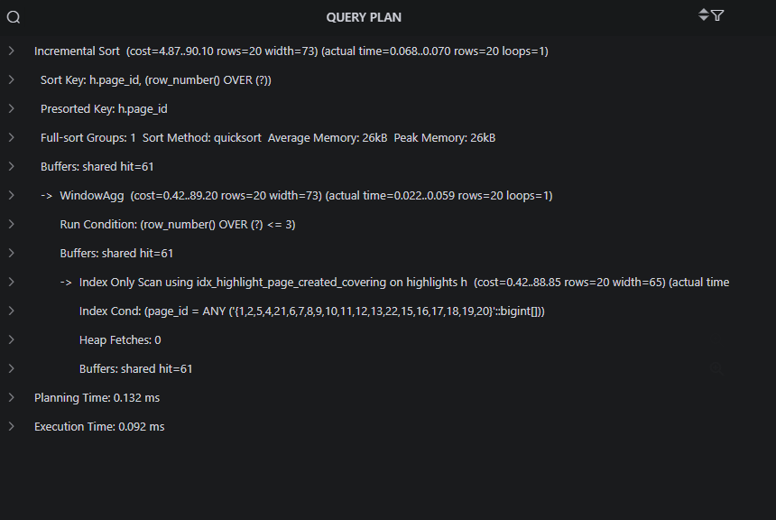
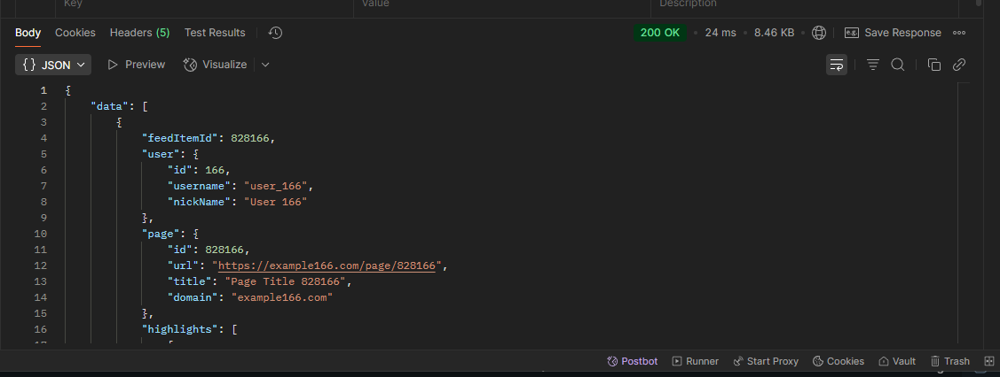
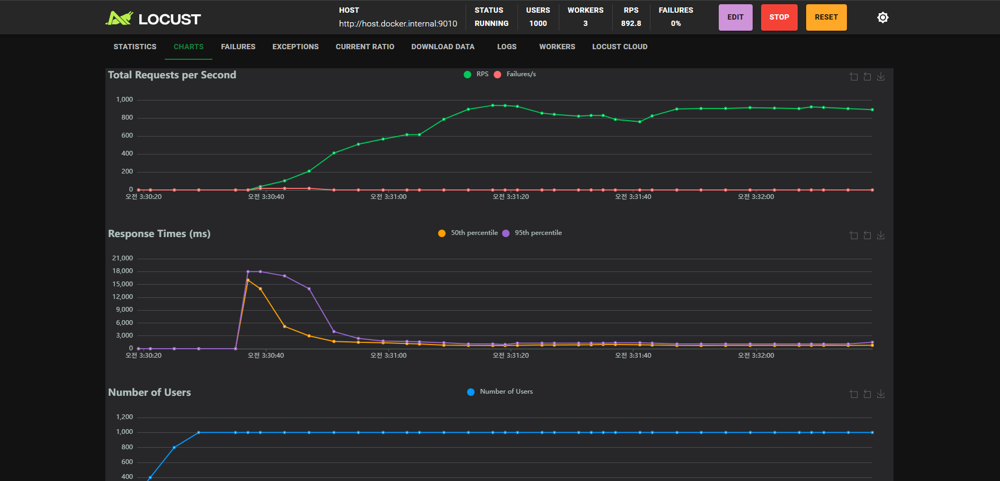

# feed-postgresql-query-tuning
하이라이팅되는 내용을 피드의 형태로 유저에게 보여주는 간단한 api 형태 입니다. 피드 내 페이지는 유저가 해당 페이지에 하이라이트했던 내용을 포함합니다.

# 프로젝트 목표
- PostgreSQL 환경에서 대용량 트래픽을 가정하여 쿼리 성능을 최적화하는 것을 목표로 합니다.

# 가상 시나리오
- 사용자 피드 및 하이라이트 기능을 제공하는 서비스
- Feed : 특정 컬럼 기준 내림차순 정렬, 대용량 데이터
- Highlight : 생성 시간 기준으로 내림차순 정렬, 높은 트래픽 발생

# 사용 기술
- PostgreSQL

# 핵심 튜닝 포인트
- 쿼리 플랜을 통해서 인덱스 분석, 정렬 방식을 의도치 않은 정렬을 사용하진 않는지, 적절한 상황에 맞는 조인을 사용하는지 등등
    - 인덱스 : 가장 비효율적은 Full Scan(seq scan)을 하진 않는지 확인 후 인덱스 scan으로 개선 과정
    - 정렬 : 기존 메모리양은 4MB인데 이를 넘어서게 되면 외부 정렬을 하게 된다 따라서 외부 정렬을 하진 않는지 확인하고 개선
    - 조인 : 특정 상황에 맞는 조인이 있는데 nested loop, hash, merge 등이 존재하고 각각에 대해서 적절히 사용하는지 확인 후 왜 쿼리 플랜이 이러한 조인을 선택하게 되었는지 쿼리와 연관 지어서 설명

# 튜닝 전/후 성능 비교
- 각 쿼리 별로 튜닝 이전의 쿼리 플랜과 실행시간 분석 후 원인이 뭐였는지 확인 및 개선이 이 연습 프로젝트의 최종 목표입니다. 

# 첫 번째 쿼리 시도

- 테스트를 하기 위한 데이터 삽입
삽입 후 데이터에 대한 쿼리를 실행 및 통계를 확인 하였습니다.

## 초기 쿼리 성능 분석

### 실행 통계 분석


```
첫 번째 쿼리 (피드 목록 조회): 15ms, 21 rows
두 번째 쿼리 (하이라이트 조회): 2ms, 20 rows
총 JDBC 실행 시간: 1,767,662,300 nanoseconds (약 1.77초)
```

### 성능 문제점 식별

1. **과도한 실행 시간**
   - 단순한 피드 목록 조회에 1.77초는 매우 느림
   - 대용량 트래픽 환경에서는 허용 불가능한 수준

2. **복잡한 조인 구조**
   ```sql
   FROM feed_items fi1_0
   JOIN users u1_0 ON u1_0.id=fi1_0.user_id
   JOIN pages p1_0 ON p1_0.id=fi1_0.page_id
   LEFT JOIN highlights h1_0 ON h1_0.page_id=fi1_0.page_id AND h1_0.user_id=fi1_0.user_id
   LEFT JOIN mentions m1_0 ON m1_0.highlight_id=h1_0.id
   ```
   - 4개 테이블 조인으로 인한 복잡도가 증가하였고 이로 인해 카테시안 곱을 유발할 수 있음
   - LEFT JOIN으로 인한 데이터 증폭이 될 수 있음
   - join으로 인한 복잡도로 index를 안탈 수 도 있다는 것을 고려해야 됨

3. **WHERE 절 조건 복잡성**
   ```sql
   WHERE fi1_0.visibility=? OR fi1_0.visibility=? AND u1_0.id=? OR fi1_0.visibility=? AND m1_0.mentioned_user_id=?
   ```
   - 복합 OR 조건으로 인한 인덱스 활용 제한
   - 멘션 조건 검사를 위한 추가 조인 필요
   - 의도대로 된 쿼리가 아님

4. **GROUP BY 필요성**
   - LEFT JOIN으로 인한 중복 데이터 제거 필요
   - 9개 컬럼에 대한 그룹핑으로 인한 추가 오버헤드

### 예상 원인
- **비효율적 조인**: 멘션 조건 확인을 위한 불필요한 LEFT JOIN
- **정렬 오버헤드**: 데이터가 많다보니까 메모리에서 정렬이 해결이 안되서 외부 정렬을 사용할 수도 있음
- **비 인덱스** : 복잡한 join 조건으로 인해 인덱스가 안탈 수도 있음

### 쿼리 플랜 분석
.png "쿼리 플랜 피드 조회 쿼리")
- 첫 번째 쿼리 : FeedItem 조회하는 쿼리 플랜 분석
쿼리 플랜을 보면 인덱스를 안타고 전부 seq scan 즉 테이블을 전부 탐색하는 모습을 볼 수 있었다. 이는 즉 조인으로 인한 복잡도 증가로 인해 인덱스를 타는 것 보다 전체를 탐색하는게 더 효율적이라고 옵티마이저가 판단한 것이다.

.png "쿼리 플랜 피드 조회 쿼리")
- 외부 정렬 사용 : 한번에 너무 많은 데이터를 가져와서 정렬 시행시 기본 메모리를 초과하여 정렬을 외부 정렬을 사용한 모습을 볼 수 있다. 기본적으로는 메모리에서 정렬이 가능하다면 퀵정렬을 사용하여 더 빠르지만 이는 더 느리게 동작한 모습이다.

### 개선 초점
조건에 대한 부분을 서브 쿼리로 따로 분리하여 조회를 하여 부하를 줄이고 인덱스를 타게 하도록 개선하자.

# 두 번째 쿼리 시도

## 최적화된 쿼리 성능 분석

### 실행 통계 분석 (최적화 후)

```
첫 번째 쿼리 (ID 조회): 0ms, 21 rows
두 번째 쿼리 (피드 목록 조회): 1ms, 21 rows  
세 번째 쿼리 (하이라이트 조회): 1ms, 20 rows
총 JDBC 실행 시간: 215,610,000 nanoseconds (약 0.216초)
```

### 최적화 성과
.png "쿼리 플랜")
.png "쿼리 플랜")
.png "쿼리 플랜")
쿼리 플랜 분석 : 각 쿼리 별로 쿼리가 인덱스를 잘 타고 있는 모습을 확인할 수 있었고 

.png "쿼리 플랜")
쿼리에서 정렬이 외부 정렬이 아닌 내부 정렬 즉 퀵 정렬을 사용하는 모습을 볼 수 있었다.

1. **극적인 성능 개선**
   - **실행 시간**: 1.77초 → 0.216초 (약 **8.2배 개선**)
   - **쿼리 개수**: 2개 → 3개 (단계별 최적화)
   - **각 쿼리 실행 시간**: 15ms → 0-1ms

2. **쿼리 구조 최적화**
   ```sql
   -- 첫 번째 쿼리: EXISTS 서브쿼리 활용
   SELECT fi1_0.id
   FROM feed_items fi1_0
   WHERE (
       fi1_0.visibility = 'PUBLIC'
       OR (fi1_0.visibility = 'PRIVATE' AND fi1_0.user_id = ?)
       OR (fi1_0.visibility = 'MENTIONED' AND EXISTS(
           SELECT 1 FROM mentions m1_0
           JOIN highlights h1_0 ON h1_0.id = m1_0.highlight_id
           WHERE h1_0.page_id = fi1_0.page_id AND m1_0.mentioned_user_id = ?
       ))
   )
   AND fi1_0.highlight_count > ?
   ORDER BY fi1_0.first_highlight_at DESC, fi1_0.id DESC
   LIMIT 20;
   ```
   - **LEFT JOIN 제거**: EXISTS 서브쿼리로 대체
   - **GROUP BY 제거**: 중복 데이터 문제 해결
   - **조건 추가**: `highlight_count > 0` 필터링

3. **단계별 쿼리 분리**
   ```sql
   -- 두 번째 쿼리: IN 절 활용
   SELECT fi1_0.id, u1_0.id, u1_0.username, ...
   FROM feed_items fi1_0
   JOIN users u1_0 ON u1_0.id = fi1_0.user_id
   JOIN pages p1_0 ON p1_0.id = fi1_0.page_id
   WHERE fi1_0.id IN (?, ?, ?, ...)
   ORDER BY fi1_0.first_highlight_at DESC, fi1_0.id DESC;
   ```
   - **단순한 INNER JOIN**: 복잡한 조건 제거
   - **IN 절 활용**: 첫 번째 쿼리 결과 활용

4. 하이라이트 조회
    - 변경없습니다.

### 최적화 기법 분석

1. **쿼리 분리 전략**
   - 복잡한 단일 쿼리를 3개의 단순한 쿼리로 분리
   - 각 쿼리의 목적과 역할 명확화
   - 네트워크 오버헤드보다 쿼리 복잡도 감소 효과가 더 큼

2. **EXISTS vs LEFT JOIN**
   - EXISTS: 존재 여부만 확인, 데이터 증폭 없음
   - LEFT JOIN: 실제 데이터 조인, GROUP BY 필요
   - 멘션 조건 확인에는 EXISTS가 더 효율적임임

3. **인덱스 활용도 개선**
   - 단순한 WHERE 조건으로 인덱스 활용도 증가

### 대용량 트래픽을 견디는 피드 조회

- 대용량 트래픽을 견딜 수 있게 db의 부하를 줄이고 redis 캐시를 통해서 조회할 수 있도록 개선하였습니다.
    - redis 캐시는 자주 조회되는 첫 페이지만 캐시할 수 있도록 하였고 하이라이트는 피드 아이템 id를 통해서 조회할 수 있도록 하였습니다.

### 트래픽 테스트

- locust로 트래픽 테스트를 진행하였는데 초당 100명씩 증가하면서 1000명까지 진행을 해보았습니다. 처음엔 이 캐시 미스율이 90퍼가 넘어서 원인이 뭔가 고민을 해봤는데 기본적으로 이 피드를 조회하는 기준이 userId를 기준으로 보여지는 가시성에 따라 다른 피드가 조회됩니다. 그래서 아무리 첫페이지를 조회하게 되더라도 userId가 다 다르니까 캐시를 탈수가 없습니다. 따라서 캐시 전략을 2단계로 나눠서 진행하게 되었습니다.
   - 첫 페이지를 조회할 경우 캐시가 없을 때만 전체를 db에서 조회하도록 하고
   - 두 번째 조회시 캐시를 통해서 조회를 하되 Public만 조회를 하도록 하였습니다. 대부분의 경우 자기자신이나 Mention의 조회보단 public 조회가 많기 때문에 이에 대해서만 캐시를 적용하고
   - 나머지 private, mention 가시성에 대해서는 따로 조회를 통해서 merge 하는 방식으로 합치게 되었습니다.

| 위의 개선 방식을 통해서 캐시 히트율 90퍼 이상을 달성하였습니다. 하지만 현재 db의 조회 시간이 평균 0.2초라 캐시를 적용해도 기본 스레드 200인 상황에서 RPS가 300을 못넘는 상황입니다. 0.2초보다 더욱 개선된 조회가 필요.

### 세 번째 쿼리 시도

## 최적화된 쿼리 성능 분석

### 실행 통계 분석 (최적화 후)


```
첫 번째 쿼리 (피드 목록 조회): JOIN 방식 사용
두 번째 쿼리 (하이라이트 조회): CTE + 윈도우 함수 사용
총 JDBC 실행 시간: 7,661,600 nanoseconds (약 7.66ms)
```

### 최종 최적화 성과

1. **극적인 성능 개선**
   - **실행 시간**: 216ms → 7.66ms (약 **28배 개선**)
   - **전체 개선**: 1.77초 → 7.66ms (약 **231배 개선**)
   - **쿼리 개수**: 3개 → 2개 (구조 단순화)

2. **쿼리 구조 최종 최적화**
   ```sql
   -- 첫 번째 쿼리: INNER JOIN방식에서 인덱스를 탈 수 있도록 인덱스 설계
   SELECT fi1_0.id, u1_0.id, u1_0.username, u1_0.nick_name,
          p1_0.id, p1_0.url, p1_0.title, p1_0.domain,
          fi1_0.highlight_count, fi1_0.first_highlight_at
   FROM feed_items fi1_0
   JOIN users u1_0 ON u1_0.id = fi1_0.user_id
   JOIN pages p1_0 ON p1_0.id = fi1_0.page_id
   WHERE (
       fi1_0.visibility = 'PUBLIC'
       OR (fi1_0.visibility = 'PRIVATE' AND u1_0.id = ?)
       OR (fi1_0.visibility = 'MENTIONED' AND EXISTS(
           SELECT 1 FROM mentions m1_0
           JOIN highlights h1_0 ON h1_0.id = m1_0.highlight_id
           WHERE h1_0.page_id = p1_0.id AND m1_0.mentioned_user_id = ?
       ))
   )
   AND fi1_0.highlight_count > 0
   ORDER BY fi1_0.first_highlight_at DESC, fi1_0.id DESC
   LIMIT 20;
   ```

3. **핵심 최적화 기법**
   - **EXISTS 서브쿼리 유지**: 멘션 조건 효율적 처리
   - **INNER JOIN 활용**: 필요한 데이터만 한 번에 조회
   - **쿼리 통합**: 3단계 → 2단계로 단순화
   - **인덱스 최적화**: 새로운 복합 인덱스 추가

### 성능 지표 상세 분석

- 쿼리 플랜을 확인해보면 전부 인덱스를 타고 있고


- 인덱스 커버링을 통해서 더욱 최적화 시킨 모습을 확인할 수 있습니다.

1. **JDBC 연결 및 준비 시간**
   ```
   1,921,600 nanoseconds (1.92ms) - JDBC 연결 획득
   742,700 nanoseconds (0.74ms) - Statement 준비
   7,661,600 nanoseconds (7.66ms) - Statement 실행
   ```
   - **연결 오버헤드**: 1.92ms (전체의 25%)
   - **실제 쿼리 실행**: 7.66ms (전체의 75%)

### 최적화 전략 비교

| 단계 | 실행 시간 | 쿼리 수 | 주요 기법 | 개선율 |
|------|-----------|---------|-----------|--------|
| 1차 | 1.77초 | 2개 | 복잡한 LEFT JOIN | - |
| 2차 | 216ms | 3개 | EXISTS + 쿼리 분리 | 8.2배 |
| 3차 | 7.66ms | 2개 | INNER JOIN + 인덱스 | 231배 |

### 추가 최적화 방향

1. **커넥션 풀 최적화**
   - 연결 획득 시간 1.92ms 단축 필요
   - HikariCP 설정 튜닝
      - db의 MaxConnection의 수를 200으로 수정 후 HikariCP에선 50개까지만 사용하도록 함
      - 또한 minimum-idle의 수를 30으로 늘려서 대기시간을 낮춤

2. **인덱스 추가 최적화**
   - `highlight_count > 0` 조건용 부분 인덱스
   - 복합 정렬 인덱스 추가

3. **캐시 전략 고도화**
   - 쿼리 결과 캐싱
   - 페이지별 캐시 분할

### 단일 테스트 결과

- 쿼리를 조회해본 결과 postman에서 평균 0.02s가 나온 모습을 볼 수 있었습니다 즉 이전 결과 대비 10배 상승한 모습.

### 부하 테스트 두 번째

- 트래픽 테스트를 해본 결과 1000명의 동시 접속자의 경우 서버의 스레드를 300까지 늘렸을 때의 RPS는 거의 800~900RPS를 오갔습니다. 앞서 스레드 200일때 캐시를 적용하였을 때가 300RPS였는데 현재는 캐시 없이 900RPS까지 올라간 모습을 볼 수 있었습니다. 하지만 여전히 병목지점이 존재하는지 단일 쿼리에서 시간이 0.02초가 걸리는데 이론적으로는 더 많은 RPS가 나와야 하지만 예상보단 낮은 수치인 모습을 확인할 수 있었습니다.

### 추가 최적화 초점
- HikariCP 커넥션이 놀고 있지 않은지 확인
- 스레드 200개를 모두 적절히 사용하고 있는지 확인
